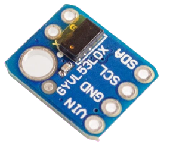
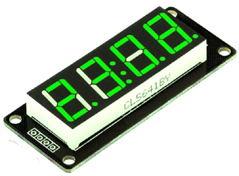
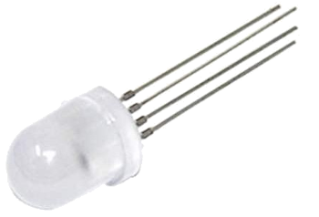
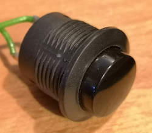
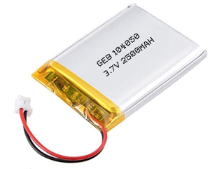
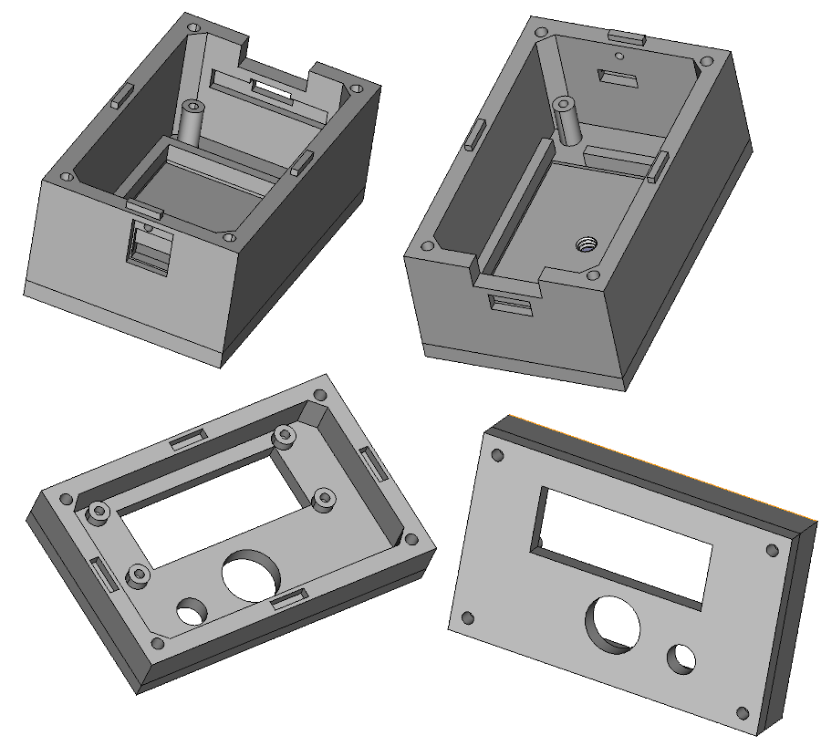

# FATRUG2

Fully automatic time project ([FAT](https://en.wikipedia.org/wiki/Fully_automatic_time)) , based on [FireBeetle 2 ESP32-E IoT Microcontroller](https://www.dfrobot.com/product-2195.html). 

## Electronics

Schema and PCB drawn in KiCAD and files are part of the project. Peripherials are following. 

- MCU

- laser distance sensor - GY-VL53L0X I2, connected via connector labeled _laser_ (SDA, SCL, 3.3V, GND)

- TM1637 4-Digit LED 0.56" 0.56inch 7 Segments Display, connected via connector labeled _7seg_

- RGB LED NeoPixel WS2812 8mm, connected via connector labeled _RGB LED_

- button, connected to ground and PIN D2 (25) 

- LiPol Batterry 104050 2500mAh 3.7V JST-PH 2.0

- 2x resistor 20k - for battery capacity measurement on PIN A0 (36)

- some JST-PH connectors, DUPONT connectors

If you make your own BOM don't forget to [multiply it by two](https://youtube.com/clip/UgkxrPXdP5GEu_9O2kQU0yOqQVvTavGrz9Ro) - you need 2 boxes.

### PCB

## Box

## State Diagram 

## Photos

