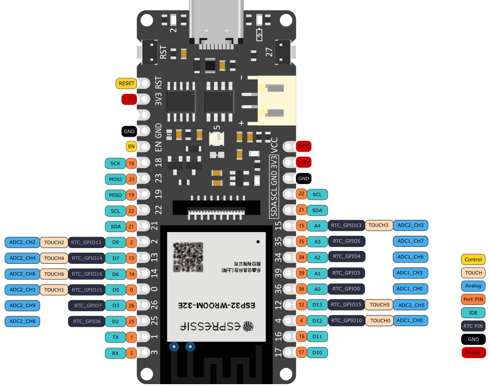
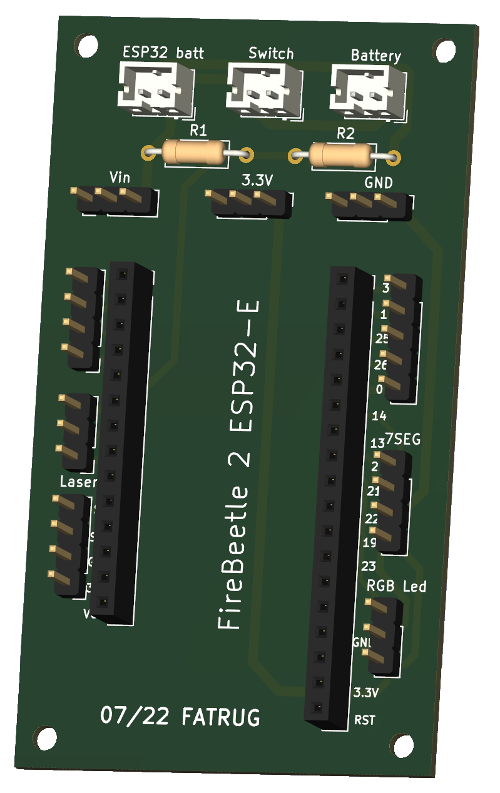

# FATRUG2

Fully automatic time project ([FAT](https://en.wikipedia.org/wiki/Fully_automatic_time)) , based on [FireBeetle 2 ESP32-E IoT Microcontroller](https://www.dfrobot.com/product-2195.html). 

## Electronics

Schema and PCB drawn in KiCAD and files are part of the project.

- ESP32-E pinout

- PCB

## State Diagram 

## Photos

