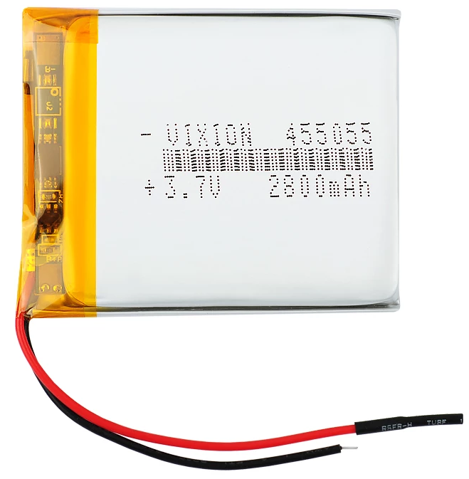

# FATRUG2

Fully automatic time project ([FAT](https://en.wikipedia.org/wiki/Fully_automatic_time)), based on [FireBeetle 2 ESP32-E IoT Microcontroller](https://www.dfrobot.com/product-2195.html). 

Usage demonstrated on [the videos](https://youtube.com/playlist?list=PLJGLIG7klYTQjR2PzYD64GDgjGLkynPeX).

Measures time between starting and finishing device. 
Basic features:
- ESP32-E IoT Microcontroller is a device brain.
- Ultrasonic distance sensor HC-SR04 with a threshold 60 - 80cm, could be more, didn't test.
- Reliable distance between devices up to 100m (depends on local conditions).
- Minimum measurement time is 100ms (avoiding false start).
- Systematic error 20-50ms, which I'm lazy to compansate.
- Able to run several hours on 2500mAh battery.
- Mountable to tripod via 1/4-20 UNC thread.

## Electronics

Schema and PCB drawn in KiCAD and files are part of the project. Original idea (and PCB) relied on laser sensor VL53L0X, however the measurement is too bad in noisy environment (sunny day). It was redesign to use ultrasonic sensor HC-SR04 instead. The ultrasonic sensor needs and TM1637 4-Digit LED need 5V (better results with 5V), step up to 5V was added. It is not yet reflected on PCB (maybe future updates), just connected with dupont wires.

Peripherials are following. 
- MCU

- ~~laser distance sensor - GY-VL53L0X I2, connected via connector labeled _laser_ (SDA, SCL, 3.3V, GND)~~

TODO: ultrasonic sensor

- TM1637 4-Digit LED 0.56" 0.56inch 7 Segments Display, connected via connector labeled _7seg_. Beware: more common display is the one with colon wired and dots unwired. Choose based on your preferences.

- RGB LED NeoPixel WS2812 8mm, connected via connector labeled _RGB LED_

- button (reset), connected to ground and PIN D2 (25) 

- LiPol Batterry 104050 2500mAh 3.7V JST-PH 2.0

- switch ([aliexpress](https://www.aliexpress.com/item/1005003268288232.html?spm=a2g0o.order_detail.0.0.5ad3f19ccqQfnJ))

- 2x resistor 20k - for battery capacity measurement on PIN A0 (36)

- some JST-PH connectors, DUPONT connectors

If you make your own BOM don't forget to [multiply it by two](https://youtube.com/clip/UgkxrPXdP5GEu_9O2kQU0yOqQVvTavGrz9Ro) - you need 2 boxes.

TODO: antennas

### PCB

## Box

## State Diagram 

## Photos

